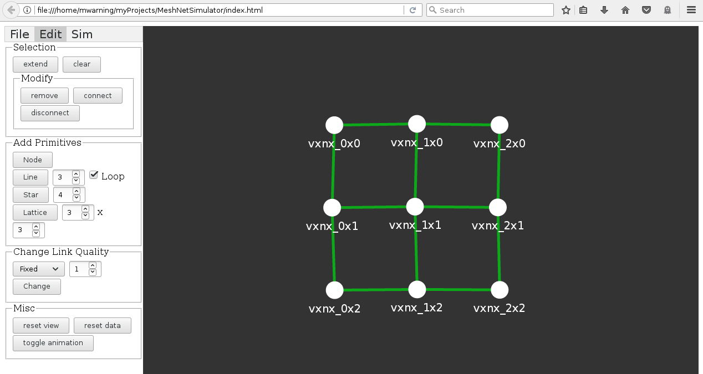

# MeshNetSimulator

A simulator for exploring/sketching mesh network routing strategies.
The code is written in plain JavaScript/HTML and [d3](https://d3js.org).

The project is currently incomplete. Pull request are welcome!

Features:
- load MeshViewer nodes.json/graph.json data
- graph editor
- run simple simulations

Known issues:
- file export not implemented yet
- animation toggle does not work properly
- no input file sanity check

Format Documentation:
- [MeshViewer](https://github.com/ffrgb/meshviewer)
- [NetJSON](http://netjson.org/rfc.html#rfc.section.5) (not supported yet)

License: GPLv3
